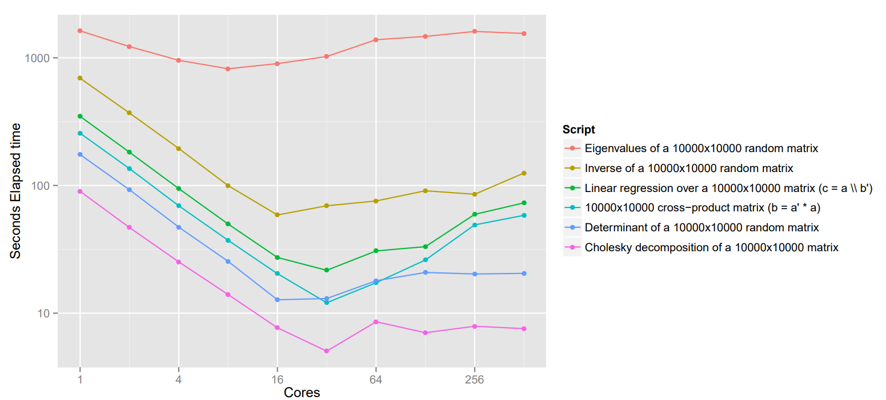
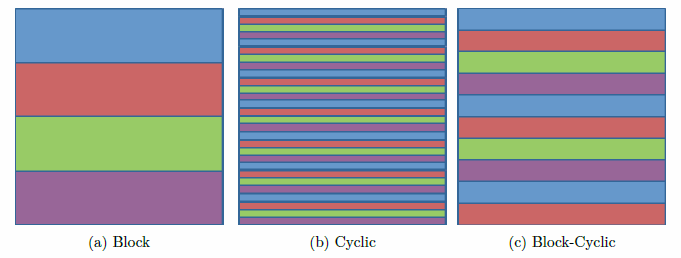
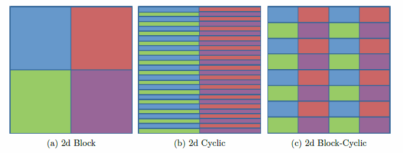
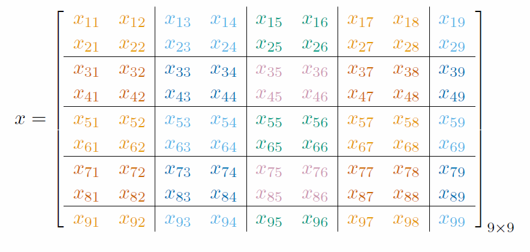
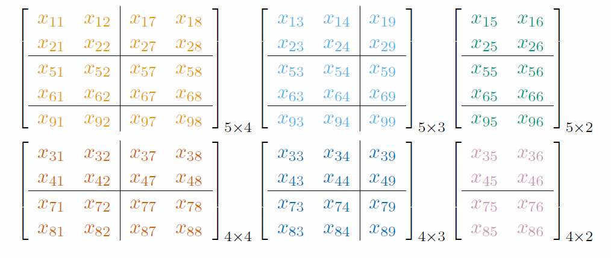
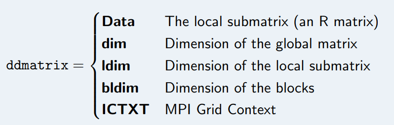

# Distributed Data Structures

## Distributed Matrices



## Matrix Distribution Schemes



## Matrix Distribution Schemes - 2D



## Then distributed across processors, the data will look like:



## local storage:



## `ddmatrix` Structure 

- For distributed dense matrix objects, we use the special S4 class
ddmatrix.



## Summary

1. `DMAT` is distributed. No one processor owns all of the matrix.
2. `DMAT` is non-overlapping. Any piece owned by one processor is owned by no other processors.
3. `DMAT` can be row-contiguous or not, depending on the blocking factor used.
4. Processor 0 = (0, 0) will always own at least as much data as every other processor.
5. `DMAT` is locally column-major and globally, it depends. . .
6. `DMAT` is confusing, but very robust and useful for matrix algebra (and thus most non-trivial statistics).

## Methods

- pbdDMAT has over 100 methods with identical syntax to R:
    - `[`, `rbind()`, `cbind()`, ...
    - `lm.fit()`, `prcomp()`, `cov()`, ...
    - `%*%`, `solve()`, `svd()`, `norm()`, ...
    - `median()`, `mean()`, `rowSums()`, ...

## Example

```r
library(pbdDMAT, quiet = TRUE)
init.grid()

dx <- ddmatrix(data = 0:1, nrow = 10, ncol = 10)

sm <- sum(dx)
comm.print(sm, all.rank = TRUE)

pd <- prod(dx)
comm.print(pd, all.rank = TRUE)

mn <- min(dx)
comm.print(mn, all.rank = TRUE)

mx <- max(dx)
comm.print(mx, all.rank = TRUE)

finalize()
```

## More Example 


# Data Input

## CSV Data: Read Serial then Distribute

```r
library(pbdDMAT)

if (comm.rank() == 0) { # only read on process 0
  x <- as.matrix(read.csv("myfile.csv "))
} else {
  x <- NULL
}
dx <- as.ddmatrix(x)

```

