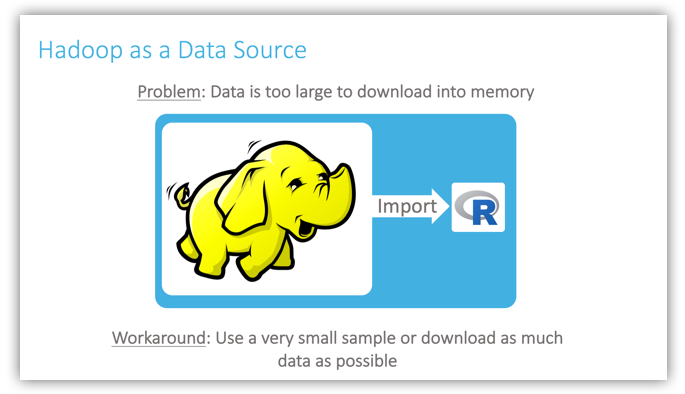
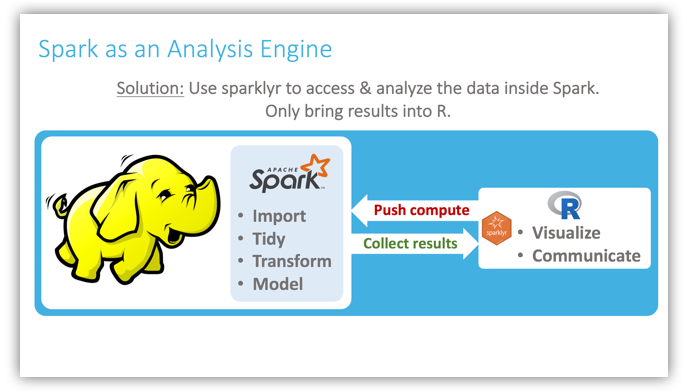
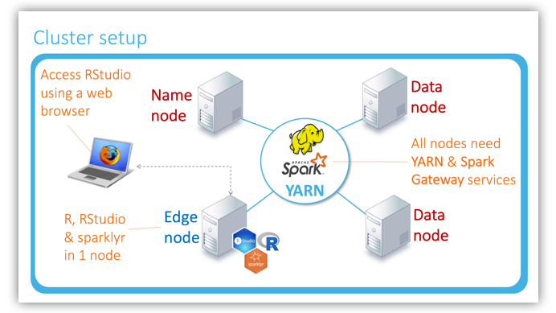
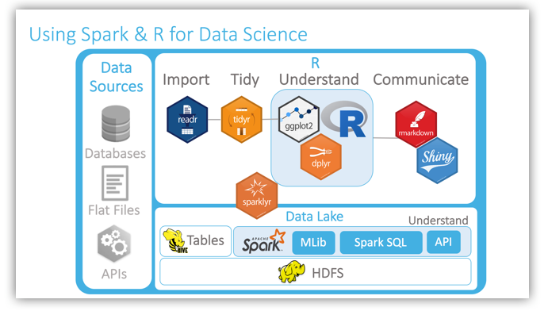

## Why Hadoop and Spark?

## Look at a chart


## Criticisim


## Example: 1D diffusion

- 52 Lines, 20+ biolerplate

```r
#!/usr/bin/env python
import numpy
from mpi4py import MPI

def ranksProcs():                            # boilerplate
    comm = MPI.COMM_WORLD
    rank = comm.Get_rank()
    nprocs = comm.Get_size()
    leftProc  = rank-1 if rank > 0 else MPI.PROC_NULL
    rightProc = rank+1 if rank < nprocs-1 else MPI.PROC_NULL
    return (comm, rank, nprocs, leftProc, rightProc)

def localnitems(procnum, nprocs, nitems):   # boilerplate
    return (nitems + procnum)/nprocs

def myRange(procnum, nprocs, ncells):       # boilerplate
    start = 0
    for p in xrange(procnum):
        start = start + localnitems(p, nprocs, ncells)
    locNcells = localnitems(procnum, nprocs, ncells)
    end = start + locNcells - 1
    return (start, locNcells, end)

def ICs(procnum, nprocs, ncells, leftX, rightX, ao, sigma):
    start, locNcells, end = myRange(procnum, nprocs, ncells)
    dx = (rightX-leftX)/(ncells-1)
    startX = leftX + start*dx
    x = numpy.arange(locNcells*1.0)*dx + startX
    temperature = ao*numpy.exp(-(x*x)/(2.*sigma*sigma))

    return temperature

def guardcellFill(data, comm, leftProc, rightProc, leftGC, rightGC):  # boilerplate
    rightData = numpy.array([-1.])           
    leftData = numpy.array([-1.])

    comm.Sendrecv(data[1],  leftProc, 1,  rightData, rightProc, 1)
    comm.Sendrecv(data[-2], rightProc, 2, leftData,  leftProc, 2)

    data[0]  = leftGC if leftProc == MPI.PROC_NULL else leftData
    data[-1] = rightGC if rightProc == MPI.PROC_NULL else rightData
    return data

def timestep(olddata, coeff):
    newdata = numpy.zeros_like(olddata)
    newdata[1:-1] = olddata[1:-1] +
                     coeff*(olddata[0:-2] - 2.*olddata[1:-1] + olddata[2:])
    return newdata

def simulation(ncells, nsteps, leftX=-10., rightX=+10., sigma=3., ao=1.,
               coeff=.375):
    comm, procnum, nprocs, leftProc, rightProc = ranksProcs()
    T = ICs(procnum, nprocs, ncells, leftX, rightX, ao, sigma)
    leftGC = T[0]   # fixed BCs
    rightGC = T[-1]
    print "IC: ", procnum, T
    for step in xrange(nsteps):
        T = timestep(T, coeff)
        guardcellFill(procnum, nprocs, T, comm, leftProc, rightProc,
                      leftGC, rightGC)    # boilerplate

    print "Final: ", procnum, T

if __name__ == "__main__":
    simulation(100, 20)

```
## same code in Python

- 28 Lines, 2 Biolerplate

```r
import numpy
from pyspark import SparkContext

def simulation(sc, ncells, nsteps, nprocs, leftX=-10., rightX=+10.,
               sigma=3., ao=1., coeff=.375):
    dx = (rightX-leftX)/(ncells-1)

    def tempFromIdx(i):
        x = leftX + dx*i + dx/2
        return (i, ao*numpy.exp(-x*x/(2.*sigma*sigma)))

    def interior(ix):                        # boilerplate
        return (ix[0] > 0) and (ix[0] < ncells-1)

    def stencil(item):
        i,t = item
        vals = [ (i,t) ]
        cvals = [ (i, -2*coeff*t), (i-1, coeff*t), (i+1, coeff*t) ]
        return vals + filter(interior, cvals)

    temp = map(tempFromIdx,range(ncells))
    data= sc.parallelize(temp).partitionBy(nprocs, rangePartitioner)
    print "IC: "
    print data.collect()
    for step in xrange(nsteps):
        print step
        stencilParts = data.flatMap(stencil)
        data = stencilParts.reduceByKey(lambda x,y:x+y)
    print "Final: "
    print data.collect()

if __name__ == "__main__":
    sc = SparkContext(appName="SparkDiffusion")
    simulation(sc, 100, 20, 4)
```
## Fashions change

- MPI stayed largely the same in those 25 years
- Complex when programming
- Hadoop and now Spark dominate discussions
- MPI is still here
- But MPI is much faster than the others because it’s bare metal!

## Hadoop and Spark

- Hadoop is an Apache open source framework written in java that allows distributed processing of large datasets across clusters of computers using simple programming models.

- Four modules

---

- Hadoop Common: These are Java libraries and utilities required by other Hadoop modules. 
- Hadoop YARN: This is a framework for job scheduling and cluster resource management.
- Hadoop Distributed File System (HDFS™): A distributed file system that provides high-throughput access to application data.
- Hadoop MapReduce: This is YARN-based system for parallel processing of large data sets.

## Spark

- Cluster computing technology, designed for fast computation
- based on Hadoop MapReduce and it extends the MapReduce model 
- in-memory cluster computing that increases the processing speed

---

> Spark is not a modified version of Hadoop and is not, really, dependent on Hadoop because it has its own cluster management. 
Hadoop is just one of the ways to implement Spark.

- Spark use Hadoop for storage and processing
- Spark has its own cluster management computation, it uses Hadoop for storage purpose only


## Best Practice for R ecosystem




---




## YARN(Yet Another Resource Negotiator) Cluster





---





---


## YARN cluster introduction


## Cluster Basics


---

## YARN Cluster


## YARN Requires a Global View


## Container


- You can think of a container as a request to hold resources on the YARN cluster
- Once a hold has been granted on a host, the NodeManager launches a process called a task


## MapReduce


## Putting it Together: MapReduce and YARN


## Setup a YARN cluster in 10 minutes on Cloud


